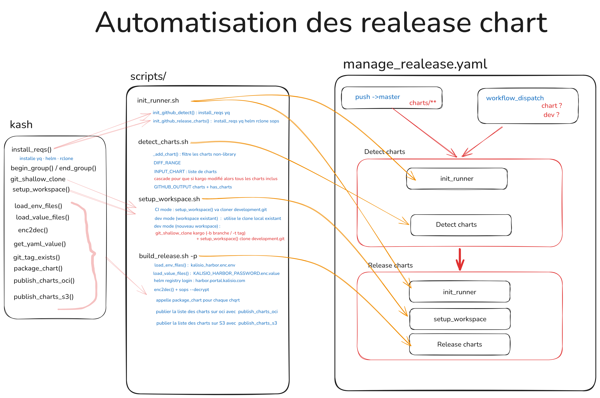
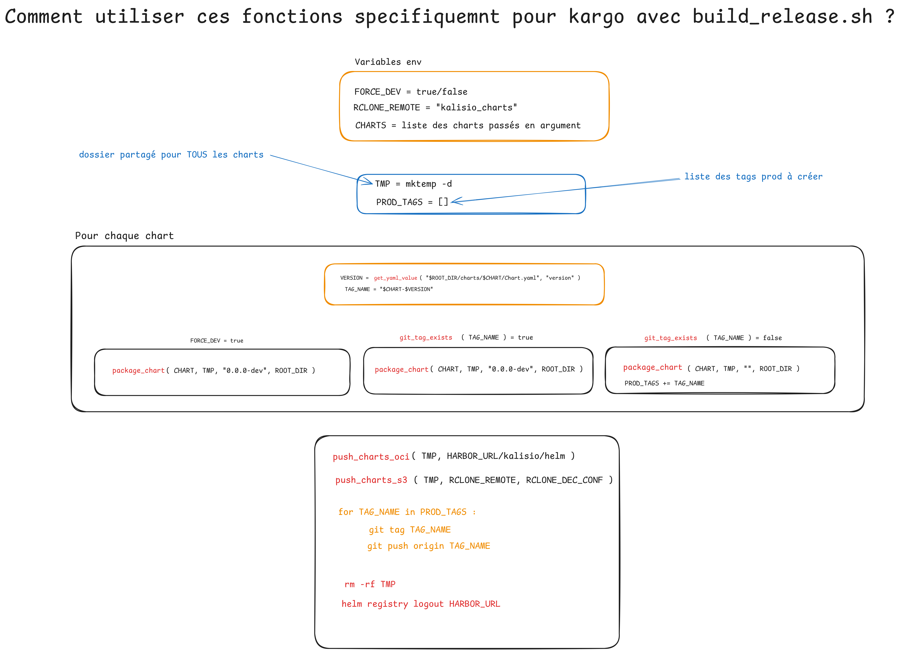
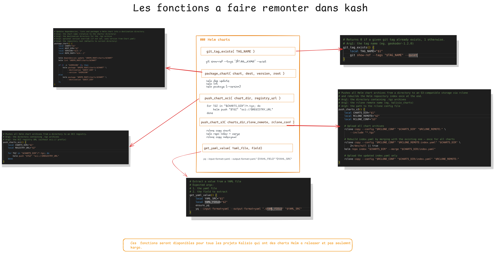

# CI/CD Pipeline Documentation for kargo

> Detailed documentation of the automated Helm chart release pipeline.  
> For a quick overview, see the [README](../../README.md).

---

## Overview

Before this pipeline was in place, releasing a Helm chart was a fully manual process: each developer had to configure credentials locally, run `release-chart.sh` from their own machine, and manually verify that Harbor and S3 had received the artefacts.

The `manage_release` pipeline automates this entirely. It is triggered on every push to `master` that touches `charts/**`, or manually via `workflow_dispatch`.

---

## Architecture

The pipeline follows the Kalisio CI conventions:

- Only **two GitHub Secrets** are used, all other credentials are encrypted with SOPS/AGE in the private `development.git` repository
- The workflow is a minimal orchestrator, all logic lives in the scripts
- Scripts are testable locally **and** in CI without modification



---

## Workflow manage_release.yaml

### Triggers

| Trigger | Condition |
|---|---|
| `push` | On `master` branch, only when files in `charts/**` are changed |
| `workflow_dispatch` | Manual trigger with optional inputs |

### Inputs (workflow_dispatch)

| Input | Description | Default |
|---|---|---|
| `charts` | Space-separated list of charts to release (eg. `geokoder trakkar`). Leave empty for automatic detection. | `""` |
| `dev` | Force a `0.0.0-dev` release even if the git tag does not exist yet | `false` |

### Concurrency

The workflow uses a concurrency group to ensure only one instance runs at a time. This prevents concurrent writes to the S3 `index.yaml` which would corrupt the Helm repository index.

```yaml
concurrency:
  group: manage_release
  cancel-in-progress: false
```

If a new run is triggered while one is already in progress, it will **wait** until the current one finishes.

### Jobs

#### Job `detect`

Detects which charts need to be released and exposes them as outputs for the next job.

```
Steps:
  1. Checkout repo  (submodules: true, fetch-depth: 0)
  2. Init runner    : bash ./scripts/init_runner.sh detect
  3. Detect charts  : bash ./scripts/detect_charts.sh
     env: GITHUB_EVENT_NAME · GITHUB_EVENT_BEFORE · GITHUB_EVENT_AFTER · INPUT_CHART

Outputs:
  charts      : space-separated list of chart names
  has_charts  : true / false
```

#### Job `release_charts`

Triggered only when `has_charts == true`. Installs tools, sets up the workspace, then releases each chart.

```
Steps:
  1. Checkout repo    (submodules: true, fetch-depth: 0)
  2. Init runner      :bash ./scripts/init_runner.sh release_charts
  3. Setup workspace  : bash ./scripts/setup_workspace.sh
     env: KALISIO_GITHUB_URL · SOPS_AGE_KEY
  4. Release charts   : bash ./scripts/build_release.sh -p <charts>
     env: SOPS_AGE_KEY · FORCE_DEV

Permissions:
  contents: write  (required to create and push git tags)
```

---

## Scripts

### `init_runner.sh`

Installs the required tools for the current job. Follows the Kalisio pattern of dynamic function dispatch based on `$CI_ID` and `$JOB_ID`.

| Job | Tools installed |
|---|---|
| `detect` | yq |
| `release_charts` | yq · helm · rclone · sops |

```bash
# CI mode
init_github_detect()        → install_reqs yq
init_github_release_charts() → install_reqs yq helm rclone sops

### `setup_workspace.sh`

Clones the private `development.git` repository which contains all encrypted credentials. Exports `KALISIO_DEVELOPMENT_DIR` for use by subsequent steps.

```bash
# In CI mode, clones development.git via KALISIO_GITHUB_URL
setup_workspace "$WORKSPACE_DIR" "$KALISIO_GITHUB_URL/kalisio/development.git"

# In Dev mode you can use existing local clone
# Usage: bash ./scripts/setup_workspace.sh ~/kalisio/kalisio
# Usage: bash ./scripts/setup_workspace.sh -b my-branch ~/kalisio/my-workspace
# Usage: bash ./scripts/setup_workspace.sh -t 1.0.0 ~/kalisio/my-workspace
```

Options (`-b` and `-t`) are only available in dev mode and allow cloning kargo itself into a new workspace on a specific branch or tag.

### `detect_charts.sh`

Detects which charts need to be released. Implements three detection strategies:

| Case | Condition | Behaviour |
|---|---|---|
| Manual | `INPUT_CHART` is set | Uses the provided chart(s) directly |
| First push | `DIFF_RANGE` is empty | Includes all non-library charts |
| Normal push | `DIFF_RANGE` is set | Uses `git diff` to find modified charts |

**Cascade rule:** if the `kargo` library chart is modified, all consumer charts are automatically included.

**Error handling:** if a chart name provided via `workflow_dispatch` does not exist, the script exits with an error immediately.

**Output separation:** logs go to `stderr`, the chart list goes to `stdout` for clean capture by the workflow. In CI, `GITHUB_OUTPUT` is written automatically.

### `build_release.sh`

The main release script. Decrypts credentials, logs into Harbor, packages all charts, then pushes to Harbor OCI and S3 in a single operation.



```bash
# Usage
bash ./scripts/build_release.sh -p chart1 chart2
FORCE_DEV=true bash ./scripts/build_release.sh -p chart1 chart2

# Dry run (no push)
bash ./scripts/build_release.sh chart1
```

**Remark:**

1. **Shared temp directory** all charts are packaged into the same `$TMP` folder, then pushed to Harbor OCI and S3 in a single operation. This means `index.yaml` is rebuilt only once, regardless of how many charts are released.

2. **PROD_TAGS array** production git tags are collected during the packaging loop and created all at once after the push operations succeed.

3. **No dependency on `release-chart.sh` or `release-dev-chart.sh`**  the CI calls kash functions directly, bypassing the local-mode checks (working tree clean, commit upstream) that would fail in a CI runner.

---

## kash functions

Five Helm-specific functions were added to [kash](https://github.com/kalisio/kash) as part of this work, under the `### Helm charts` section.

| Function | Signature | Description |
|---|---|---|
| `get_yaml_value` | `(yaml_file, field)` | Extracts a field value from any YAML file |
| `git_tag_exists` | `(tag_name, repo_dir)` | Returns 0 if a git tag exists, 1 otherwise |
| `package_chart` | `(chart, dest_dir, version, repo_root)` | Runs `helm dep update` + `helm lint` + `helm package` |
| `push_charts_oci` | `(charts_dir, registry_url)` | Pushes all `.tgz` files from a directory to an OCI registry |
| `push_charts_s3` | `(charts_dir, rclone_remote, rclone_conf)` | Uploads all `.tgz` files to S3 and rebuilds `index.yaml` once |



---

## Secrets and credentials

Only two GitHub Secrets are used. All other credentials are encrypted with SOPS/AGE in `development.git`.

| GitHub Secret | Role |
|---|---|
| `KALISIO_GITHUB_URL` | Authenticated URL to clone private Kalisio repositories |
| `SOPS_AGE_KEY` | Private AGE key to decrypt `.enc.*` files |


## Release scenarios

### Scenario 1 : Push to master (automatic)

A developer updates `charts/geokoder/Chart.yaml` and bumps the version from `1.2.0` to `1.3.0`, then pushes to `master`.

```
push → master
  → detect: git diff → geokoder detected
  → release_charts:
      VERSION = 1.3.0
      TAG = geokoder-1.3.0
      git_tag_exists? -> NO -> production release
        package_chart (version 1.3.0)
        push_charts_oci : Harbor :1.3.0
        push_charts_s3  : S3 + index.yaml
        git tag geokoder-1.3.0
```


### Scenario 2 : Push to master (dev release)

A developer modifies `charts/geokoder/templates/deployment.yaml` without bumping the version.

```
push → master
  → detect: git diff → geokoder detected
  → release_charts:
      VERSION = 1.2.0
      TAG = geokoder-1.2.0
      git_tag_exists? ->  YES ->  dev release
        package_chart (version 0.0.0-dev)
        push_charts_oci : Harbor :0.0.0-dev
        push_charts_s3  : S3 + index.yaml
        no git tag
```

### Scenario 3 : Manual release via workflow_dispatch


Go to **Actions ->  manage_release ->  Run workflow**:

- **Specific charts**: fill in `charts` with `geokoder trakkar`
- **Force dev**: check the box to force `0.0.0-dev` even if the tag is absent
- **All charts**: leave `charts` empty

> [!WARNING]
> Leaving `charts` empty will trigger a release for all 65 charts. Use with caution in production.

---

## How to use

### As a developer, pushing changes

Simply push your changes to `master`. If you modified files under `charts/**`, the pipeline triggers automatically. No manual action required.

> [!NOTE]
> If you try to run `release-chart.sh` manually after pushing, you may get an error saying the chart already exists on Harbor. This means the CI already published it — this is expected behaviour.
